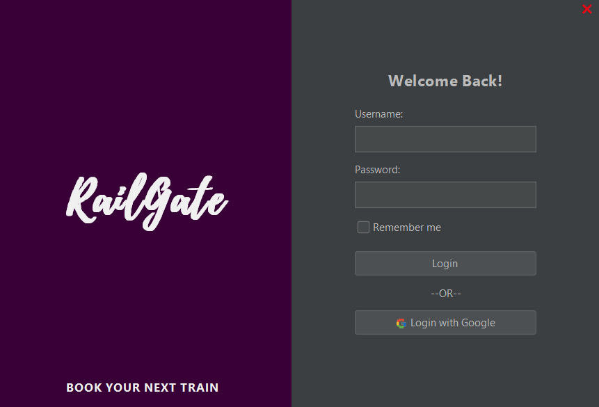
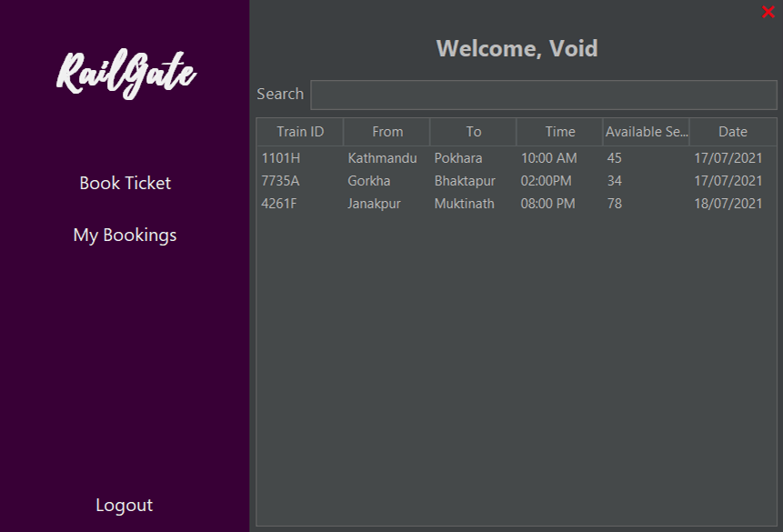
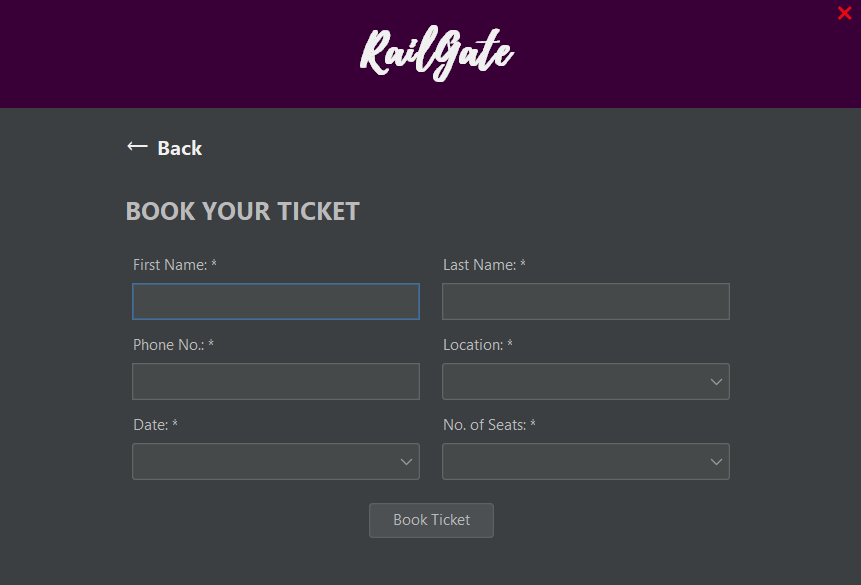
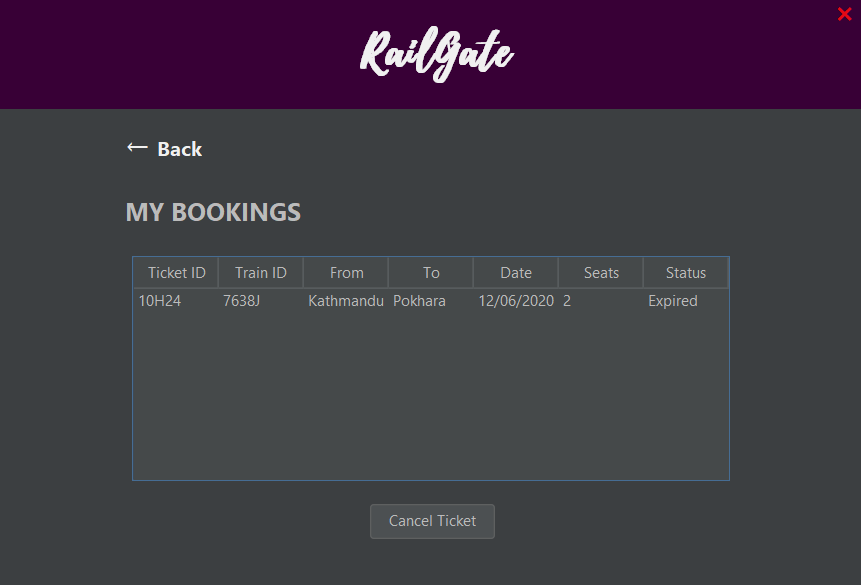

# RailGate
RailGate is a simple train booking system created with Java Swing.

## Screenshots
- Login Page

- Dashboard Page

- Book Ticket Page

- Bookings Page

## Prerequisite

- Java 8 or higher
- IntelliJ IDEA / Apache NetBeans / Eclipse

## Running the project

- Clone the repository

  ``git clone https://github.com/ayxsth/RailGate.git``
- Open the IDE
- Go to the **Open Project** section
- Run the project